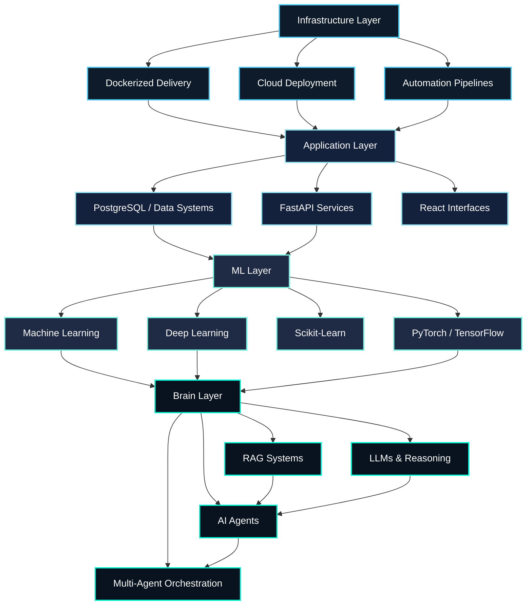
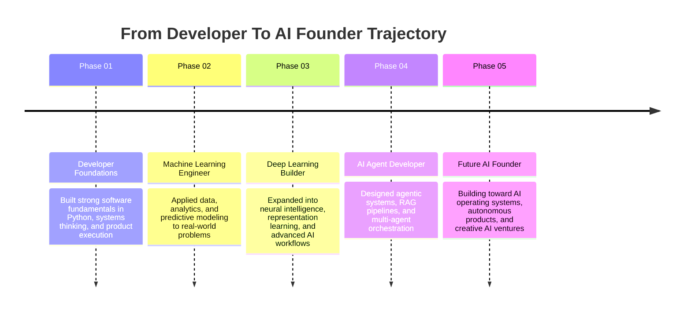

<!--
Personalization checklist before publishing:
1. Replace YOUR_GITHUB_USERNAME in repo links and live GitHub widgets.
2. Replace your-linkedin-slug, your-email@domain.com, and your-portfolio-url.com.
3. Replace the four featured-project impact lines with real proof points.
4. Optional: swap "Phase 01..05" in the timeline for actual years.
-->

<div align="center">
  
</div>

<div align="center">
  
</div>

<p align="center">
  <strong>AI Engineer | Machine Learning Engineer | Deep Learning Engineer | AI Agent Developer | Full-Stack AI Builder</strong>
</p>

<p align="center">
  I architect intelligent systems that move from idea to deployment: agentic workflows, RAG platforms, ML pipelines, automation engines, and full-stack AI products designed for real business outcomes.
</p>

<p align="center">
  <a href="https://github.com/YOUR_GITHUB_USERNAME">GitHub</a>
  |
  <a href="https://www.linkedin.com/in/your-linkedin-slug/">LinkedIn</a>
  |
  <a href="mailto:your-email@domain.com">Email</a>
  |
  <a href="https://your-portfolio-url.com">Portfolio</a>
</p>

## AI Operating System v3.0

<table>
  <tr>
    <td width="52%" valign="top">
      <pre><code>SYSTEM            : RAVINDRA//AI-OS
STATUS            : ONLINE
ARCHITECTURE      : Applied Intelligence + Product Execution
PRIMARY MODE      : BUILD / RESEARCH / SHIP
SPECIALIZATION    : Agents, ML, DL, RAG, Automation
BUSINESS LAYER    : Analytics, decision systems, operational leverage
CURRENT MISSION   : Build autonomous AI systems that create real-world value</code></pre>
    </td>
    <td width="48%" valign="top">
      <p><strong>Capability Matrix</strong></p>
      <p>[OK] <strong>AI Agents</strong> -> autonomous workflows, tool use, orchestration</p>
      <p>[OK] <strong>Machine Learning</strong> -> prediction, classification, insight generation</p>
      <p>[OK] <strong>Deep Learning</strong> -> neural intelligence and representation learning</p>
      <p>[OK] <strong>RAG Systems</strong> -> grounded answers over private knowledge</p>
      <p>[OK] <strong>Full-Stack AI</strong> -> APIs, frontends, data layers, deployment</p>
      <p>[OK] <strong>Automation</strong> -> turning repetitive work into scalable systems</p>
    </td>
  </tr>
</table>

> I do not build AI for screenshots. I build systems that reason through complexity, connect with real data, and ship as products people can actually use.

## Founder Story

I operate at the intersection of **intelligence, product, and execution**.

My work is centered on turning advanced AI into systems that are useful in the real world: agents that act, RAG pipelines that understand context, ML models that uncover signal, and full-stack applications that make those capabilities accessible.

What makes that work valuable is the business lens. I care about more than model quality. I care about whether the system reduces friction, saves time, improves decisions, unlocks leverage, or creates entirely new product experiences.

The long-term vision is bigger than individual tools. I am building toward a future where AI systems behave less like isolated features and more like collaborators: autonomous, reliable, creative, and deeply embedded into how people work and build.

## AI Technology Ecosystem



## Featured Projects Showcase

> Replace the repo links and impact lines below with your strongest builds. The structure is already written to read like premium product cards instead of generic repo bullets.

<table>
  <tr>
    <td width="50%" valign="top">
      <h3><a href="https://github.com/YOUR_GITHUB_USERNAME/project-one">Autonomous Agent Platform</a></h3>
      <p><strong>Mission</strong><br/>Design an agentic system that can plan tasks, retrieve context, use tools, and execute workflows with minimal human intervention.</p>
      <p><strong>Problem Solved</strong><br/>Eliminates fragmented, manual decision chains by turning them into a coordinated AI workflow.</p>
      <p><strong>Technology</strong><br/><code>Python</code> <code>LangChain</code> <code>LangGraph</code> <code>RAG</code> <code>FastAPI</code> <code>Docker</code></p>
      <p><strong>Impact</strong><br/>Replace this line with a real proof point: time saved, workflow automation, customer support acceleration, or operational lift.</p>
      <p><strong>Result</strong><br/>A strong showcase of end-to-end thinking across reasoning, orchestration, APIs, and production architecture.</p>
    </td>
    <td width="50%" valign="top">
      <h3><a href="https://github.com/YOUR_GITHUB_USERNAME/project-two">RAG Knowledge Intelligence Engine</a></h3>
      <p><strong>Mission</strong><br/>Build a retrieval-augmented system that transforms raw documents and domain knowledge into grounded, decision-ready answers.</p>
      <p><strong>Problem Solved</strong><br/>Reduces information bottlenecks and improves the accuracy of AI outputs over specialized knowledge bases.</p>
      <p><strong>Technology</strong><br/><code>Python</code> <code>Vector DB</code> <code>Embeddings</code> <code>FastAPI</code> <code>PostgreSQL</code> <code>Prompt Engineering</code></p>
      <p><strong>Impact</strong><br/>Replace this line with a real proof point: answer quality, response speed, analyst productivity, or search efficiency gains.</p>
      <p><strong>Result</strong><br/>Demonstrates grounded intelligence, data pipeline design, and business-ready AI architecture.</p>
    </td>
  </tr>
  <tr>
    <td width="50%" valign="top">
      <h3><a href="https://github.com/YOUR_GITHUB_USERNAME/project-three">AI Automation &amp; Decision Copilot</a></h3>
      <p><strong>Mission</strong><br/>Create a system that automates repetitive business workflows and surfaces smarter recommendations in real time.</p>
      <p><strong>Problem Solved</strong><br/>Turns slow, manual operations into scalable automation backed by intelligence and analytics.</p>
      <p><strong>Technology</strong><br/><code>Python</code> <code>Automation</code> <code>APIs</code> <code>Business Analytics</code> <code>Dashboards</code> <code>Cloud</code></p>
      <p><strong>Impact</strong><br/>Replace this line with a real proof point: hours saved, process efficiency, cost reduction, or decision-quality improvement.</p>
      <p><strong>Result</strong><br/>Shows the ability to connect AI with measurable business outcomes rather than isolated experiments.</p>
    </td>
    <td width="50%" valign="top">
      <h3><a href="https://github.com/YOUR_GITHUB_USERNAME/project-four">Creative AI Studio / AI Filmmaking System</a></h3>
      <p><strong>Mission</strong><br/>Explore the intersection of AI, narrative, media, and creative production through intelligent content workflows.</p>
      <p><strong>Problem Solved</strong><br/>Bridges technical AI capability with storytelling, creative tooling, and human-centered content systems.</p>
      <p><strong>Technology</strong><br/><code>Generative AI</code> <code>Creative Automation</code> <code>Python</code> <code>Prompt Systems</code> <code>Full Stack</code></p>
      <p><strong>Impact</strong><br/>Replace this line with a real proof point: production speed, content throughput, creative experimentation, or audience engagement gains.</p>
      <p><strong>Result</strong><br/>Adds a rare creative edge to the profile and signals range beyond conventional engineering.</p>
    </td>
  </tr>
</table>

## AI Journey Timeline



## Live AI Analytics Center

<div align="center">
  
  
</div>

<div align="center">
  
  
</div>

<div align="center">
  
</div>

## Recruiter Quick Scan

| Signal | What It Tells You |
| --- | --- |
| **Can this person build?** | Yes. Strong emphasis on full-stack AI systems, APIs, automation, data workflows, and deployment-minded engineering. |
| **Can this person solve business problems?** | Yes. The profile is framed around leverage: reducing friction, improving decisions, saving time, and creating usable AI products. |
| **Can this person ship products?** | Yes. The narrative centers on moving from model or idea to end-to-end execution and user-facing systems. |
| **Can this person work with AI seriously?** | Yes. Core positioning spans ML, deep learning, RAG, AI agents, multi-agent systems, and generative AI. |
| **Should I interview this person?** | Yes, especially for roles spanning applied AI, agentic systems, ML engineering, AI product development, automation, or AI-first startups. |

## Why Hire Ravindra?

<table>
  <tr>
    <td width="33%" valign="top">
      <strong>AI Depth</strong><br/><br/>
      Works across the spectrum from classical ML to deep learning, retrieval systems, agents, and multi-step orchestration.
    </td>
    <td width="33%" valign="top">
      <strong>Product Thinking</strong><br/><br/>
      Builds with the end user, the workflow, and the business objective in mind, not just the model.
    </td>
    <td width="33%" valign="top">
      <strong>Execution Speed</strong><br/><br/>
      Comfortable taking ideas from whiteboard to working system through code, architecture, APIs, and deployment.
    </td>
  </tr>
  <tr>
    <td width="33%" valign="top">
      <strong>Automation Mindset</strong><br/><br/>
      Looks for repetitive friction and replaces it with scalable intelligent systems.
    </td>
    <td width="33%" valign="top">
      <strong>Business Fluency</strong><br/><br/>
      Understands analytics, leverage, and operational impact, which is useful to product teams, founders, and decision-makers.
    </td>
    <td width="33%" valign="top">
      <strong>Creative Edge</strong><br/><br/>
      Brings an unusual combination of technical AI capability and AI filmmaking / creative systems thinking.
    </td>
  </tr>
</table>

## Future Vision

I am not only interested in building better models. I am interested in building **better intelligence systems**.

- **Multi-Agent Platforms** that coordinate reasoning, memory, tools, and execution across complex workflows.
- **Autonomous Business Systems** that reduce manual operations and create continuous leverage for teams.
- **AI Operating Systems** that make intelligence feel native inside products, not bolted on.
- **Creative AI Studios** that merge storytelling, automation, and generative systems into new forms of media creation.
- **AI SaaS Products** that turn powerful research ideas into elegant, usable, high-impact products.

## Build Philosophy

```text
Research-grade thinking
+ Product-grade usability
+ Startup-grade speed
+ Production-grade execution
= Intelligent systems worth shipping
```

## Let's Build The Future With AI

If you are building AI products, intelligent automation, agentic systems, or next-generation developer tools, let's connect.

<p align="center">
  <a href="mailto:your-email@domain.com">Email</a>
  |
  <a href="https://www.linkedin.com/in/your-linkedin-slug/">LinkedIn</a>
  |
  <a href="https://github.com/YOUR_GITHUB_USERNAME">GitHub</a>
  |
  <a href="https://your-portfolio-url.com">Portfolio</a>
</p>

<div align="center">
  
</div>
