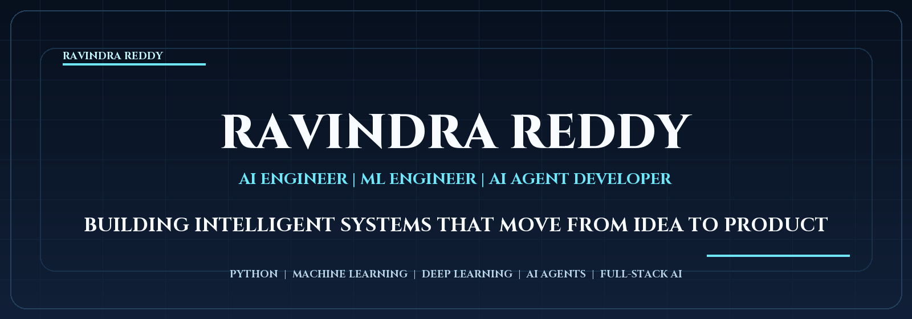
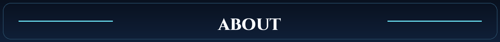
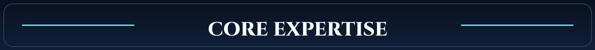
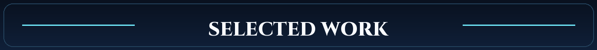
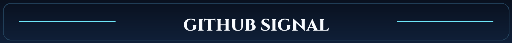
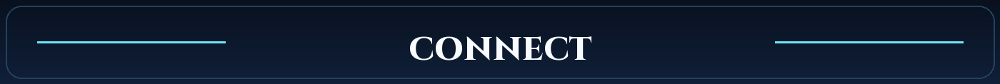

  

  Building intelligent systems that move from idea to product.

  <a href="https://github.com/ravindrareddy17">github.com/ravindrareddy17</a>

  

AI Engineer focused on machine learning, deep learning, AI agents, and full-stack execution. I build practical systems that automate work, surface insight, and turn AI into products people can actually use.

  

  <code>Python</code>
  <code>Machine Learning</code>
  <code>Deep Learning</code>
  <code>AI Agents</code>
  <code>LangChain</code>
  <code>LangGraph</code>
  <code>RAG Systems</code>

  <code>FastAPI</code>
  <code>React</code>
  <code>Docker</code>
  <code>Automation</code>
  <code>Business Analytics</code>
  <code>Full-Stack AI</code>

  

- [Flatshare Ledger](https://github.com/ravindrareddy17/flatshare-ledger) - Full-stack expense intelligence platform with anomaly detection, settle-up logic, and AI-assisted reporting.
- [TaskFlow](https://github.com/ravindrareddy17/Task-Flow) - Collaborative task manager with real-time chat, media sharing, and polished product design.
- [MBTI Personality Predictor](https://github.com/ravindrareddy17/-MBTI-Personality-Predictor) - Streamlit machine learning app that turns free-form text into interactive personality predictions.
- [Movie Analytics Prediction](https://github.com/ravindrareddy17/Movie-Analytics-Prediction) - Analytics and ML workflow spanning data cleaning, visualization, SQL, and prediction.

  

  
  

  

  Open to AI engineering, machine learning, and AI product-building opportunities.

  <a href="https://github.com/ravindrareddy17">GitHub</a>

