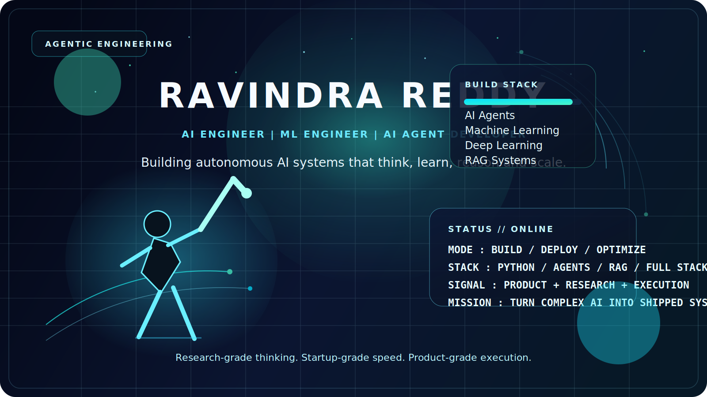
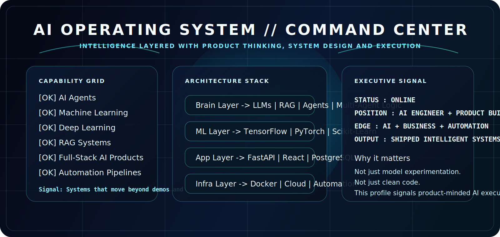
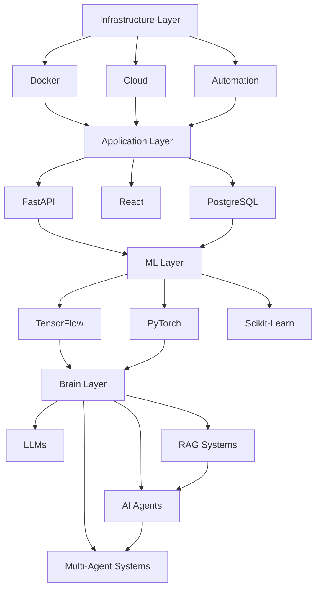
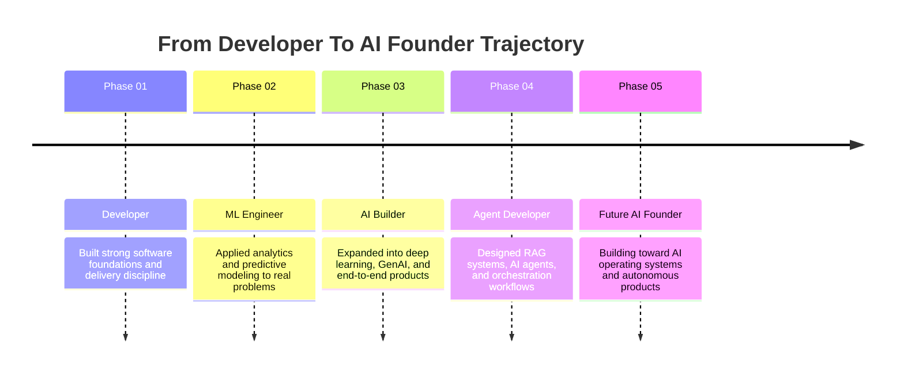
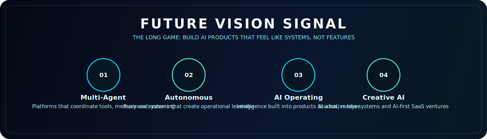

<!--
Repository note:
Keep the assets/ folder with this README because the profile design uses custom SVG visuals.
-->

<p align="center">
  
</p>

<p align="center">
  <strong>AI Engineer | Machine Learning Engineer | Deep Learning Engineer | AI Agent Developer | Full-Stack AI Builder</strong>
</p>

<p align="center">
  Precision under pressure. Intelligent systems that learn, reason, automate and ship.
</p>

<p align="center">
  <a href="https://github.com/ravindrareddy17">GitHub</a>
</p>

## Cinematic Signal

This profile is built to communicate one clear message in the first few seconds:

**Ravindra Reddy builds intelligent AI systems, understands business leverage, and ships products that move beyond demos.**

<p align="center">
  
</p>

## Founder Signal

<table>
  <tr>
    <td width="52%" valign="top">
      <h3>Who I Am</h3>
      <p>I work at the intersection of AI engineering, product execution, and business impact.</p>
      <p>I build agentic systems, RAG pipelines, ML applications, automation layers, and full-stack AI products that are designed to solve real operational problems.</p>
      <p>The goal is not to collect experiments. The goal is to build intelligence that can be used, deployed, and trusted.</p>
    </td>
    <td width="48%" valign="top">
      <h3>Why It Matters</h3>
      <p><strong>AI Depth</strong><br/>ML, DL, LLMs, RAG, agents, orchestration.</p>
      <p><strong>Product Thinking</strong><br/>Builds with user outcomes and business goals in mind.</p>
      <p><strong>Execution</strong><br/>Moves from model to API to interface to deployment.</p>
      <p><strong>Automation Edge</strong><br/>Turns repetitive workflows into scalable systems.</p>
    </td>
  </tr>
</table>

> I do not build AI for screenshots. I build systems that create leverage.

## AI Technology Ecosystem



<table>
  <tr>
    <td width="25%" valign="top">
      <strong>Brain Layer</strong><br/><br/>
      LLMs, RAG, agents, memory, orchestration, reasoning loops.
    </td>
    <td width="25%" valign="top">
      <strong>ML Layer</strong><br/><br/>
      TensorFlow, PyTorch, Scikit-Learn, deep learning, predictive modeling.
    </td>
    <td width="25%" valign="top">
      <strong>Application Layer</strong><br/><br/>
      FastAPI, React, data systems, interfaces, backend services.
    </td>
    <td width="25%" valign="top">
      <strong>Infrastructure Layer</strong><br/><br/>
      Docker, cloud deployment, automation pipelines, reliable delivery.
    </td>
  </tr>
</table>

## Featured Projects Showcase

<table>
  <tr>
    <td width="50%" valign="top">
      <h3><a href="https://github.com/ravindrareddy17/flatshare-ledger">Flatshare Ledger</a></h3>
      <p><strong>Mission</strong><br/>Build a production-quality shared-expense platform that can ingest messy real-world household data and turn it into clean, actionable financial signals.</p>
      <p><strong>Problem Solved</strong><br/>Transforms inconsistent CSV exports into structured balances, anomaly reports, and settle-up suggestions.</p>
      <p><strong>Technology</strong><br/><code>React 19</code> <code>Vite</code> <code>Express</code> <code>Prisma</code> <code>SQLite</code> <code>PostgreSQL</code> <code>Claude API</code></p>
      <p><strong>Impact</strong><br/>Shows product thinking, import-pipeline design, anomaly handling, optional AI summarization, and production-ready full-stack delivery.</p>
      <p><strong>Result</strong><br/>A polished engineering showcase with strong architecture, documentation, and real-world problem framing.</p>
    </td>
    <td width="50%" valign="top">
      <h3><a href="https://github.com/ravindrareddy17/Task-Flow">TaskFlow</a></h3>
      <p><strong>Mission</strong><br/>Create a collaborative task manager that feels premium, fast, and built for real team coordination.</p>
      <p><strong>Problem Solved</strong><br/>Combines task execution, chat, media sharing, and live collaboration into one unified workflow.</p>
      <p><strong>Technology</strong><br/><code>React 19</code> <code>Vite</code> <code>Tailwind CSS</code> <code>Node.js</code> <code>Express</code> <code>Socket.IO</code> <code>MySQL</code> <code>Cloudinary</code></p>
      <p><strong>Impact</strong><br/>Demonstrates strong product design instincts, full-stack architecture, real-time systems, and multi-user experience design.</p>
      <p><strong>Result</strong><br/>Signals that Ravindra can build software that is both functional and presentation-grade.</p>
    </td>
  </tr>
  <tr>
    <td width="50%" valign="top">
      <h3><a href="https://github.com/ravindrareddy17/-MBTI-Personality-Predictor">MBTI Personality Predictor</a></h3>
      <p><strong>Mission</strong><br/>Turn free-form human text into an interpretable personality prediction experience with live visual feedback.</p>
      <p><strong>Problem Solved</strong><br/>Makes text classification more accessible through an interactive ML interface instead of a static notebook workflow.</p>
      <p><strong>Technology</strong><br/><code>Python</code> <code>Streamlit</code> <code>Scikit-Learn</code> <code>TF-IDF</code> <code>Joblib</code> <code>Plotly</code></p>
      <p><strong>Impact</strong><br/>Highlights applied machine learning, model packaging, UI thinking, and the ability to turn a model into a usable product experience.</p>
      <p><strong>Result</strong><br/>Shows a clean bridge between ML experimentation and user-facing deployment.</p>
    </td>
    <td width="50%" valign="top">
      <h3><a href="https://github.com/ravindrareddy17/Movie-Analytics-Prediction">Movie Analytics Prediction</a></h3>
      <p><strong>Mission</strong><br/>Build an analytics workflow that moves from cleaning raw entertainment data to visualization, modeling, and SQL-backed insight generation.</p>
      <p><strong>Problem Solved</strong><br/>Creates a structured path from messy data to predictive analysis and decision-ready reporting.</p>
      <p><strong>Technology</strong><br/><code>Python</code> <code>Jupyter</code> <code>Pandas</code> <code>Data Visualization</code> <code>Machine Learning</code> <code>SQL</code></p>
      <p><strong>Impact</strong><br/>Demonstrates a full analytics pipeline across cleaning, feature work, exploration, modeling, and relational thinking.</p>
      <p><strong>Result</strong><br/>Strengthens the business analytics side of the profile with a clear data-to-insight narrative.</p>
    </td>
  </tr>
</table>

## AI Journey Timeline



## Live AI Analytics Center

<div align="center">
  
  
</div>

<div align="center">
  
  
</div>

<div align="center">
  
</div>

## Recruiter Quick Scan

| Question | Signal |
| --- | --- |
| Can this person build? | Yes. The profile is positioned around full-stack AI systems, APIs, automation, data workflows, and deployment. |
| Can this person solve business problems? | Yes. The framing is about leverage, speed, decisions, and useful products, not isolated models. |
| Can this person ship products? | Yes. The story consistently moves from idea to system to interface to execution. |
| Can this person work with AI seriously? | Yes. ML, DL, RAG, LLMs, agents, multi-agent systems, and generative AI are core to the profile. |
| Should I interview Ravindra? | Yes, especially for applied AI, AI engineering, agentic systems, AI product, automation, and startup roles. |

## Future Vision

<p align="center">
  
</p>

- Multi-agent platforms that coordinate tools, memory, reasoning, and execution.
- Autonomous business systems that create continuous operational leverage.
- AI operating systems that make intelligence feel native inside products.
- Creative AI studios that merge storytelling, automation, and generative systems.
- AI SaaS products that turn research ideas into elegant, high-impact tools.

## Build Philosophy

```text
Research-grade thinking
+ Product-grade usability
+ Startup-grade speed
+ Production-grade execution
= Intelligent systems worth shipping
```

## Let's Build The Future With AI

If you are building AI products, intelligent automation, RAG systems, developer tools, or agentic platforms, let's connect.

<p align="center">
  <a href="https://github.com/ravindrareddy17">GitHub</a>
</p>
